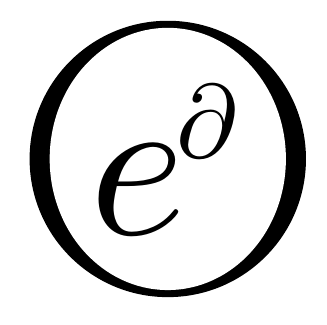

<div align="center"><a href="https://github.com/ZigaSajovic/dCpp">
<br><br></a></div>

-----------------

[](https://github.com/ZigaSajovic/dCpp/releases/tag/v0.1.0)

# dCpp
Automatic differentiation in C++; infinite differentiability of conditionals, loops, recursion and all things C++

**dCpp** is a tool for automatic differentiation made to be _intuitive_ to the mind of a _C++_ programmer and non-invasive to his process. Despite its _easy to use nature_ it retains flexibility, allowing implementations of differentiable (sub) programs operating on differentiable derivatives of other (sub) programs, where the entire process may again be differentiable. This allows trainable training processes, and flexible program analysis through operational calculus.

dCpp was originally developed as an example of how [automatic differentiation](https://en.wikipedia.org/wiki/Automatic_differentiation) can be viewed through the theory of [Operational Calculus on Programming Spaces](https://en.wikipedia.org/wiki/Automatic_differentiation#Operational_calculus_on_programming_spaces), which provides Deep Learning with a formal calculus. It has since been applied to a variety of tasks from dynamical systems analysis and digital geometry, to general program analysis and optimization by various parties.

### Tutorial

We demonstrate the utilities of _dCpp_ on a simple encapsulating example.

First we include the necessities

```c++
#include <iostream>
#include <dCpp.h>
```

We initialize an _n_-differentiable programming space

```c++
using namespace dCpp;
int n_differentiable = 3;
dCpp::initSpace(n_differentiable);
```

#### The Basics

The API of ```var``` complies with those for the standard _C++_ types, and when an instance of ```var``` is left uninitialized it behaves as the _type_ ```double``` would have. We may envision an instance of ```var``` as an element of the differentiable virtual memory algebra, elevating _C++_ to a differentiable programming space _dCpp_. This means that any program can be made differentiable by simply substituting the _type_ ```double``` for _type_ ```var``` and that the coding process of the user can be left unchanged towards the initially intended goal.

By coding a simple recursive function ```foo``` we see that the usual usage of constructs such as conditionals, loops and recursion remains unchanged.
```c++
var foo(const var& x, const var& y)
{
    if(x < 1)
        return y;
    else if(y < 1)
        return x;
    else
        return x / foo(x / 2, y) + y * foo(x, y / 3);
}

```
To test it, we declare two instances of ```var```.

```c++
var x=10;
var y=13;
```
Variables with respect to which differentiation is to be performed need to be _initialized_ as such. This assures that uninitialized instances behave as the type ```double``` does. With the difference that _all instances_ of ```var``` are differentiable _with respect_ to all _initialized_ instances.

```c++
dCpp::init(x);
dCpp::init(y);
```

The derivatives are extracted by specifying the memory location of the variable with respect to which differentiation is to be performed.

```c++
var f = foo(x,y);
std::cout <<  f << std::endl;
std::cout <<  f.d(&x) << std::endl;
std::cout << f.d(&y) << std::endl;
```
> 884.998
>
>82.1202
>
>193.959

#### Differentiable derivatives

The _virtual memory space_ is constructed through tensor products of _C++_ internal representation of the memory. This means that derivatives are themselves elements of the differentiable virtual memory.

```c++
var fx = f.d(&x);
std::cout <<  fx.d(&x) << std::endl;
std::cout <<  fx.d(&y) << std::endl;
var fy = f.d(&y);
std::cout <<  fy.d(&x) << std::endl;
std::cout <<  fy.d(&y) << std::endl;
```
>-0.103319
>
>18.7722
>
>18.7722
>
>28.8913


We can thus employ derivatives of ```f``` in further _n-1_-_differentiable_ calculations.

```c++
var F = dCpp::sqrt((fx^2) + (fy^2));
std::cout <<  F << std::endl;
std::cout <<  F.d(&x) << std::endl;
std::cout <<  F.d(&y) << std::endl;
```
>210.627
>
>17.2464
>
>33.9239

As the derivatives of ```f``` are _n-1_-differentiable (twice, in our case), we can interweave them in calculations containing ```f``` itself.

```c++
var t = dCpp::sqrt(((fx^2) + (fy^2)) / f);
std::cout <<  t << std::endl;
std::cout <<  t.d(&x) << std::endl;
std::cout <<  t.d(&y) << std::endl;
```

>7.08016
>
>0.251241
>
>0.364486

**This is particularly useful when analyzing and optimizing differential equations, where usually both ```f``` and its (higher) derivatives appear in the same expression.**

#### A note on the order of differentiability

The order of an expression if that of the lowest order of the expressions appearing in its construction.

| Expression                  | Order   |
| :--------------------------:| :-----: |
| f                           | 3       |
| fx = f.d(&x)                | 2       |
| fy = f.d(&y)                | 2       |
| (fx^2 + fy^2) / f           | 2       |
| fxx = fx.d(&x)              | 1       |
| fxy = fx.d(&y)              | 1       |
| f * (fxy + fxx) / (fx - fy) | 1       |

This means, that when we want to perform some **non-differentiable** operation on an expression, such as incrementing a variable in a gradient descent iteration, we should extract the **value** of its derivative using the ```id``` attribute of the instance ```var```.
```c++
double lambda = 0.1;
double fx_double = f.d(&x).id
x += lambda * fx_double;
double fy_double = f.d(&x).id
y += lambda * fy_double
```

An example of a gradient descent can be found in [examples/baricenterGD](https://github.com/ZigaSajovic/dCpp/blob/master/examples/baricenterGD.cpp) with a detailed explanation available in the closed issue
[here](https://github.com/ZigaSajovic/dCpp/issues/2#issuecomment-276057623).


#### Operator dTau

If a certain mapping the user desires is not provided in the [dCpp](https://github.com/ZigaSajovic/dCpp/blob/master/include/dCpp.h) namespace, but its derivative exists, he may create the desired map by employing the operator ```tau```. 

Lets assume that the map ```log``` is not provided and create it using ```tau```, by providing it with two maps, ```log```: **double --> double** and ```log_primitive```: **var --> var**.
 
 ```c++
var log_primitive(const var& v)
{   
    return 1 / v;
}

tau log(std::log, log_primitive);
```
The map is now ready to use
 ```c++
var l=log(((x^2) - (y^0.23))^2.1);
std::cout <<  l << std::endl;
std::cout <<  l.d(&x) << std::endl;
std::cout <<  l.d(&y) << std::endl;
```
>9.63263
>
>0.427715
>
>-0.000682522

#### Examples

* [examples/softmax](https://github.com/ZigaSajovic/dCpp/blob/master/examples/softmax.cpp) demonstrates the construction of a vectorized softmax.
* [examples/baricenterGD](https://github.com/ZigaSajovic/dCpp/blob/master/examples/baricenterGD.cpp) demonstrates gradient descent on the example of finding a baricenter.
* [examples/dTauUse](https://github.com/ZigaSajovic/dCpp/blob/master/examples/dTauUse.cpp) demonstrates the use of the ```tau``` operator.
* [examples/dEigenSoftmax](https://github.com/ZigaSajovic/dCpp/blob/master/examples/dEigenSoftmax.cpp) demonstrates integration with external libraries, on the example of [Eigen](http://eigen.tuxfamily.org/index.php?title=Main_Page).

#### Further reading

As the presenting tutorial is quite brief, please consult the discussions regarding common mistakes and solutions.

* [Common mistakes with initializations, differentiability of differentiable processes, and general understanding of functionality](https://github.com/ZigaSajovic/dCpp/issues/2#issuecomment-276048860)
* [Solutions with detailed explanations of the rationale behind them](https://github.com/ZigaSajovic/dCpp/issues/2#issuecomment-276057623)

Or consult the concerning papers.

*  [Operational calculus on programming spaces](https://arxiv.org/abs/1610.07690) is the paper in which the theory is derived and the process of its use to the purpose of program analysis and deep learning is outlined.
*  [Implementing Operational calculus on programming spaces for Differentiable computing](https://arxiv.org/abs/1612.02731) is the paper in which the implementation of this theory into dCpp is explained, where the reader is guided through the code and the theory simultaneously, as to better understand the tool.

### Citation
If you use _[dCpp](https://github.com/ZigaSajovic/dCpp)_ in your work, please cite one of the following papers

>Žiga Sajovic, et al.: [Operational calculus on programming spaces](https://arxiv.org/abs/1610.07690). arXiv e-prints arXiv:1610.07690 (2016)


```
@article{
    Author = {Žiga Sajovic, et al.},
    Title = {Operational calculus on programming spaces},
    journal = {arXiv e-prints},
    Year = 2016,
    volume = {arXiv:1610.0769},
    Eprint = {1610.07690},
    Eprinttype = {arXiv},
}
```    
>Žiga Sajovic: [Implementing Operational calculus on programming spaces for Differentiable computing](https://arxiv.org/abs/1612.02731). arXiv e-prints arXiv:1612.02731 (2016)

```
@article{
    Author = {Žiga Sajovic},
    Title = {Implementing Operational calculus on programming spaces for Differentiable computing},
    journal = {arXiv e-prints},
    Year = 2016,
    volume = {arXiv:1612.0273},
    Eprint = {1612.02731},
    Eprinttype = {arXiv},
}
```    

<a rel="license" href="http://creativecommons.org/licenses/by/4.0/"></a><br /><span xmlns:dct="http://purl.org/dc/terms/" property="dct:title">dC++</span> by <a xmlns:cc="http://creativecommons.org/ns#" href="https://si.linkedin.com/in/zigasajovic" property="cc:attributionName" rel="cc:attributionURL">Žiga Sajovic</a> is licensed under a <a rel="license" href="http://creativecommons.org/licenses/by/4.0/">Creative Commons Attribution 4.0 International License</a>.
